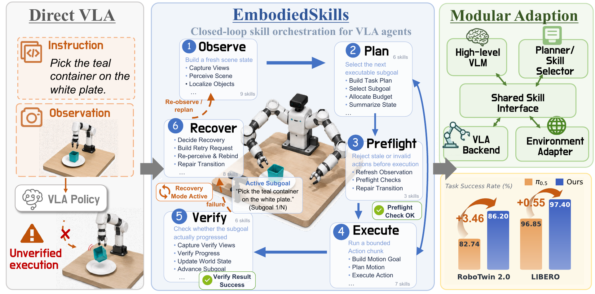
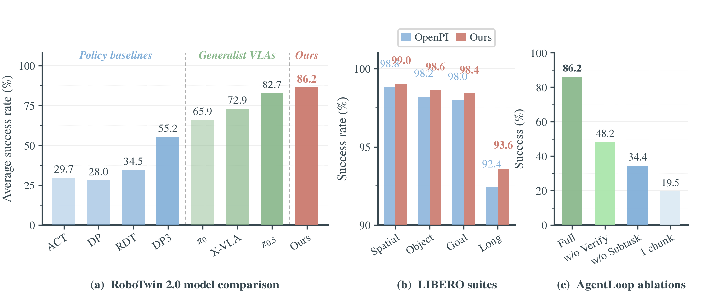
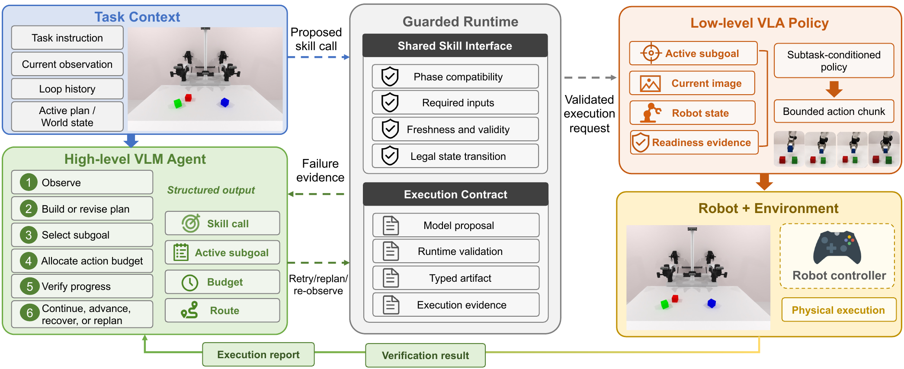
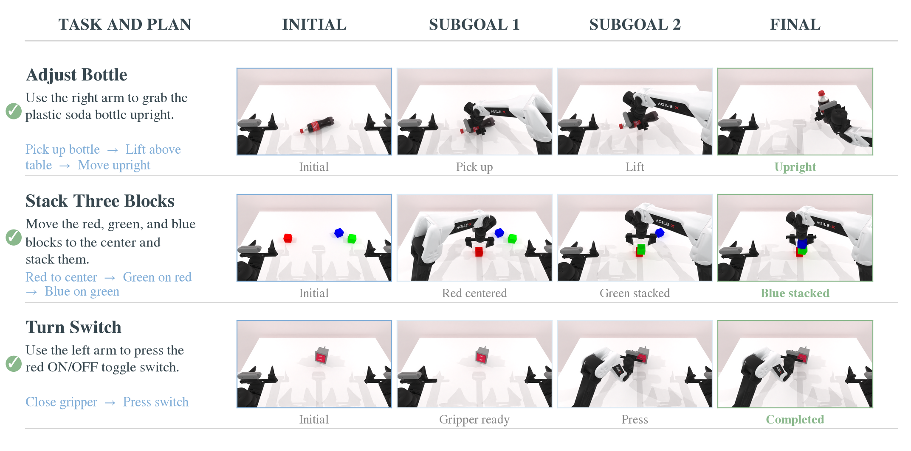

# EmbodiedSkills

<p align="center">
  
</p>

EmbodiedSkills is a closed-loop runtime for vision-language-action agents. A
high-level VLM works through six stages: observation, planning, preflight,
bounded execution, verification, and recovery. The runtime checks every skill
request before it reaches the robot and records the result for the next model
decision. Planning, verification, the low-level VLA policy, and the environment
adapter share stable interfaces and can be trained or replaced independently.

This release contains the AgentLoop used in our experiments, adapters for
RoboTwin 2.0, RMBench, and LIBERO, a persistent OpenPI/$\pi_{0.5}$ action
backend, frame-aligned subtask training for $\pi_{0.5}$, and Qwen3-VL LoRA
training from full AgentLoop trajectories. The Python package remains
`clawvla` for compatibility with existing manifests and checkpoints; the
distribution and repository are named `embodiedskills`.

## Results

| Benchmark | Evaluation | Reference | EmbodiedSkills |
| --- | ---: | ---: | ---: |
| RoboTwin 2.0 | 50 tasks, 100 episodes per task | $\pi_{0.5}$ 82.74 | **86.20** |
| LIBERO | Spatial, Object, Goal, and Long | OpenPI 96.85 | **97.40** |
| RMBench $M(n)$ | 4 memory-dependent tasks | X-VLA 7.3 | **12.5** |

The controlled RoboTwin 2.0 study uses the same 50 tasks and 5,000 episodes for
each setting. Full AgentLoop reaches 86.20%; removing intermediate verification
reduces success to 48.2%, using the full task instruction in place of semantic
subtasks reaches 34.4%, and limiting every subtask to one action chunk reaches
19.5%.

<p align="center">
  
</p>

## System

<p align="center">
  
</p>

The VLM receives the task instruction, current images, world state, active plan,
and compact loop history. It proposes a typed skill call. The guarded runtime
checks phase compatibility, required inputs, freshness, action validity, and
legal state transitions. A validated execution request is sent to the VLA
backend as an active subgoal, current observation, robot state, and bounded
action budget. The execution report and fresh verification images return to the
AgentLoop, which can continue, advance, re-observe, recover, or replan.

The local vLLM launcher keeps multiple LoRAs resident and routes model calls by
component or skill. Adapter selection changes the served LoRA name without
loading weights for every request.

<p align="center">
  
</p>

## Installation

The runtime uses Python 3.12. Benchmark simulators, OpenPI, LLaMA-Factory, and
vLLM have separate CUDA environments and are installed from their upstream
repositories.

```bash
git clone https://github.com/DCDmllm/EmbodiedSkills.git
cd EmbodiedSkills
python -m venv .venv
source .venv/bin/activate
pip install -e .
cp .env.example .env
```

Fill in the repository, checkpoint, and endpoint paths in `.env`, then export
them before loading a runtime config. Missing variables are reported when the
config is read.

```bash
set -a
source .env
set +a
```

## Running AgentLoop

An OpenAI-compatible VLM endpoint and a persistent OpenPI worker are sufficient
for the standard launcher:

```bash
embodiedskills-run \
  --config configs/runtime/robotwin.json \
  --instruction "Place the container on the plate." \
  --artifact-prefix robotwin_example \
  --max-steps 80 \
  --run
```

`configs/runtime/rmbench.json` and `configs/runtime/libero.json` select the
other environments. Subgoal verification controls local progress; final task
success always comes from the benchmark evaluator.

For a local Qwen3-VL model with resident LoRAs:

```bash
embodiedskills-run-vllm \
  --base-config configs/runtime/robotwin.json \
  --model Qwen/Qwen3-VL-8B-Instruct \
  --served-model-name base \
  --lora-module agent=/path/to/agent_skill_lora \
  --model-route scheduler=agent \
  --model-route vision=agent \
  --model-route state=agent \
  --model-route verifier=agent \
  --model-route recovery=agent \
  --gpus 0,1 \
  --tensor-parallel-size 2 \
  --instruction "Place the container on the plate." \
  --max-steps 80 \
  --run
```

## Training

### Subtask-conditioned $\pi_{0.5}$

RoboTwin demonstrations are collected from successful expert executions. Each
subtask keeps its source HDF5, frame range, accepted instruction, and completion
criterion. The loader samples the current frame, three RGB views, 14-dimensional
robot state, current subtask, and at most 32 actions from the same segment. A
short final window repeats the segment's last action, so its label never enters
the next subtask.

```bash
bash scripts/collect_robotwin_expert_subtasks.sh \
  --settings both \
  --episodes-per-task 50 \
  --workers 4 \
  --gpus 0,1,2,3

python scripts/merge_robotwin_expert_subtasks.py \
  --source data/run_a \
  --source data/run_b \
  --output-dir data/robotwin_merged

embodiedskills-build-robotwin-vla-data \
  --mapping data/accepted_subtask_mapping.jsonl \
  --source-root data/robotwin_merged \
  --split-manifest data/robotwin_merged/splits/task_split.json \
  --output-dir data/pi05_subtasks
```

RMBench uses the segment durations in its official `language_annotation.json`:

```bash
embodiedskills-build-rmbench-vla-data \
  --source-root /path/to/rmbench/data/task_name/demo_clean \
  --output-root data/rmbench_task_subtasks \
  --val-episodes 5
```

OpenPI integration is documented in
[`integrations/openpi/README.md`](integrations/openpi/README.md). The supplied
recipe uses a 32-step action horizon, episode-level splits, FSDP, normalization
statistics from the prepared dataset, and checkpoint initialization through
OpenPI's standard trainer. Per-task specialist datasets can be prepared with
`embodiedskills-split-vla-tasks`.

### Qwen3-VL AgentLoop LoRA

The trajectory collector replays successful expert segments through the same
AgentLoop prompt renderer and history compaction used at deployment. Training
rows cover plan generation, observation, state updates, scheduling, preflight,
execution, verification, and engineering recovery cases. Every plan-generation
row and every accepted recovery row is retained; remaining skills are sampled
across tasks, decision families, and history depths.

```bash
embodiedskills-collect-agent-trajectories \
  --dataset-root data/robotwin_merged \
  --repair-ledger data/subtask_repairs.jsonl \
  --task-instruction-repairs data/task_instruction_repairs.jsonl \
  --split-manifest data/robotwin_merged/splits/task_split.json \
  --config configs/runtime/robotwin.json \
  --output-dir data/qwen_agent_corpus

embodiedskills-build-agent-sft \
  --corpus-dir data/qwen_agent_corpus \
  --engineering-dir data/qwen_agent_engineering \
  --output-dir data/qwen_agent_skill \
  --train-size 30000 \
  --val-size 3000

LLAMA_FACTORY_ROOT=/path/to/LLaMA-Factory \
CUDA_VISIBLE_DEVICES=0,1,2,3 \
bash scripts/train_qwen_agent_lora.sh
```

The default recipe uses Qwen3-VL-8B-Instruct, FlashAttention 2, DeepSpeed
ZeRO-3, LoRA rank 64, a 65,536-token context, validation every 50 optimizer
steps, and W&B logging. Configuration details and data contracts are in
[`docs/training.md`](docs/training.md).

## Repository layout

```text
src/clawvla/               AgentLoop, runtime, skills, components, and adapters
src/clawvla/training/      frame-aligned subtask dataset
configs/runtime/           RoboTwin, RMBench, and LIBERO runtime configurations
configs/qwen/              Qwen3-VL LoRA and DeepSpeed configuration
integrations/openpi/       OpenPI dataset hook and training recipe
scripts/                   collection, merge, and training wrappers
docs/                      architecture, benchmark, and training notes
```

The release is focused on the supervised training and deployment path used by
the paper. Historical RL experiments, generated datasets, checkpoints, videos,
machine-specific paths, and fixed-sequence VLA replay programs are outside the
source tree. Generated artifacts belong under `data/` or `artifacts/`, both of
which are ignored by Git.
