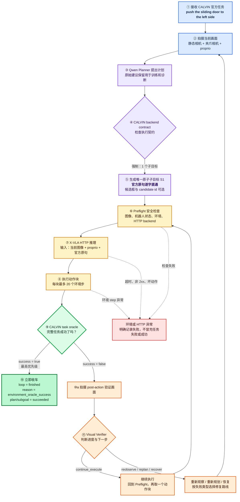
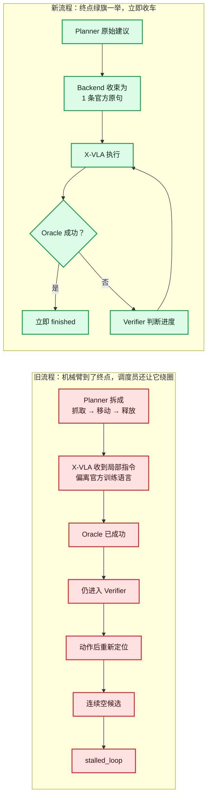

# 阶段 3 CALVIN 任务流程可视化

## 当前完整流程



## 旧流程与新流程对比



## 一句话理解各角色

|角色|形象比喻|职责|
|---|---|---|
|Planner|接单员|理解任务并提出计划；原始建议保留供训练|
|CALVIN backend contract|工单闸机|把计划收束成 X‑VLA 真正会执行的一条官方原子指令|
|Preflight|发车检查员|检查相机、机器人状态、环境和动作服务是否健康|
|X‑VLA|机械臂驾驶员|根据图像、proprio 和官方指令输出动作块|
|Verifier|途中观察员|oracle 尚未成功时，判断继续、重观察还是恢复|
|CALVIN oracle|终点裁判|对完整任务拥有最高判定权；绿旗一举，Agent 立即结束|

## 本次真实成功轨迹

```text
接单 → 拍照 → 原子计划 → Preflight
     → 20 步动作 → 未成功 → Verifier → 继续
     → 20 步动作 → 未成功 → Verifier → 继续
     → 20 步动作 → 未成功 → Verifier → 继续
     → 第 61 个环境步 → Oracle 成功 → 当场结束
```

关键数字：61 个环境步、37 个 Agent 决策、0 次 localization、0 个失败技能。
